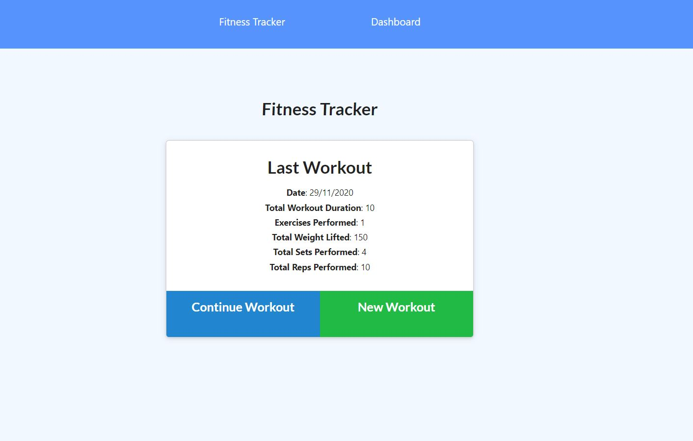
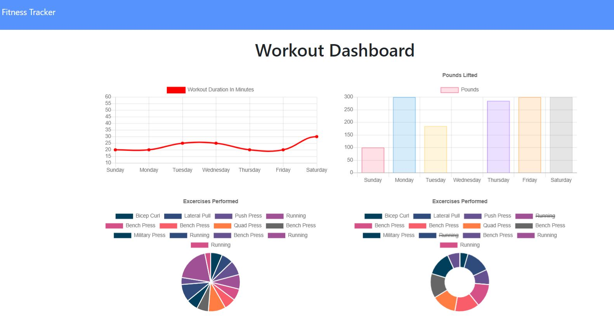

# Workout-Tracker
* [Description](#description)
* [Installation](#installation)
* [Usage](#usage)
* [License](#license)
* [Contributing](#contributing)
* [Tests](#tests)
* [Questions](#questions)
## Description
The Project is made to track the workouts either cardio/resistance and can generate statistics and graph so, you can easily track your performance.
## Installation
1. Install /make sure that these are installed `node.js`  and `MongodB` .
2. Git Clone the repo and install all dependencies `npm install` in the terminal.
3. Create a `.env` file and add one line `PORT=8080` or any other valid port number of your choice and save.
4. type `npm start` in your terminal.
5. go to your favorite browser and type `http://localhost:8080` (change 8080 to the port number you have entered in the `.env` file).

## Usage
Start Entering your workouts everyday and after a week or so go and watch the stats dashboard to see how did you go.

you can alsonavigate to [work-out-tracker](https://workouts-tracker-tony.herokuapp.com/)

#### Landing Page 

#### Dashboard /Statistics Page

## Contributing
Pull requests are welcome. For major changes, please open an issue first to discuss what you would like to change.
## Tests
Run the application, select the various options available, including:
* Can you create a workout.
* Can you create a exercise.
* Can you view the stats?
## Questions
You are welcome to provide any feedback and/or ask questions.
Please, send any question to my e-mail [tonymelek.au@gmail.com](mailto:tonymelek.au@gmail.com) and/or visit my profile on [Github](https://github.com/tonymelek)

## License
The project is protected under MIT,you may need to read through license conditions